# PHASE 2.5: ACQUISITION & REQUEST/PAYLOAD ACCOUNTING
**Project:** `zielonebety1`  
**Status:** Authoritative Network & Payload Accounting Specification  
**Evidence Level:** FACT-CODE & FACT-RUNTIME Verified  

---

## 1. Provider Acquisition Decomposition

The system communicates with Superbet and Betclic using distinct network protocols, endpoint structures, and caching strategies.

```mermaid
flowchart TD
    subgraph Superbet_Acquisition [Superbet Acquisition Lifecycle]
        SB_DiscReq[1. Discovery HTTP GET: /v3/pl-PL/events] --> SB_DiscResp[Raw Overview Catalog JSON]
        SB_DiscResp --> SB_Cache[Cache Discovery Items + Overview Payloads in metadata.raw]
        SB_Cache --> SB_Select[Detail Selection: 8 Selected IDs]
        SB_Select --> SB_DetailFetch[2. Fetch: 8 Detail HTTP GETs to /v2/pl-PL/events/id]
        SB_DetailFetch --> SB_Combine[Combine: 8 Detail Responses + 119 Cached Overview Payloads]
        SB_Combine --> SB_Parsed[Parse: 127 SuperbetEvent Models]
    end

    subgraph Betclic_Acquisition [Betclic Acquisition Lifecycle]
        BC_DiscReq[1. Discovery HTTP GET / SSR HTML: /v2/sportsbook/football/events] --> BC_DiscResp[Raw Catalog JSON / HTML SSR]
        BC_DiscResp --> BC_Cache[Cache Discovery Items + Overview Payloads in metadata.raw]
        BC_Cache --> BC_Select[Detail Selection: 8 Selected IDs]
        BC_Select --> BC_DetailFetch[2. Fetch: 8 Detail gRPC-Web POSTs to /v2/sportsbook/events/id]
        BC_DetailFetch --> BC_Combine[Combine: 8 Detail Responses + 12 Cached Overview Payloads]
        BC_Combine --> BC_Parsed[Parse: 20 BetclicEvent Models]
    end
```



---

## 2. Request & Object Accounting Matrix

| Metric / Dimension | Superbet (Live / Full) | Superbet (Replay `multi_bookmaker_v1`) | Betclic (Live / Full) | Betclic (Replay `multi_bookmaker_v1`) | Definition & Source Authority | Evidence Level |
|:---|:---:|:---:|:---:|:---:|:---|:---:|
| **Discovery Requests** | 1 | 1 (mock) | 1 | 1 (mock) | Network request to catalog endpoint to discover upcoming fixtures. | FACT-CODE |
| **Overview Payloads** | 1 (containing 1,640 matches) | 1 (containing 127 matches) | 1 (containing 367 matches) | 1 (containing 20 matches) | Root JSON catalog array/dictionary returned by discovery endpoint. | FACT-CODE |
| **Detail Selection Budget** | 15 (NORMAL) / 50 (DEEP) | 8 (all matched) | 15 (NORMAL) / 50 (DEEP) | 8 (all matched) | Maximum number of events allocated for deep market acquisition (`effective_max_detail_requests`). | FACT-CODE |
| **Detail HTTP Requests** | 15–50 | 0 (replay reuses mock payloads) | 15–50 | 0 (replay reuses mock payloads) | Actual network calls issued to individual match detail endpoints. | FACT-CODE |
| **Total HTTP Requests** | $1 + N_{\text{detail}}$ ($16–51$) | 1 | $1 + N_{\text{detail}}$ ($16–51$) | 1 | Total TCP/TLS sessions established during the scan cycle. | FACT-CODE |
| **HTTP Responses Received** | $1 + N_{\text{detail}}$ | 1 | $1 + N_{\text{detail}}$ | 1 | Number of completed HTTP 200 responses received over the wire. | FACT-CODE |
| **Raw Payloads Processed** | 1,640 logical payloads | 127 logical payloads | 367 logical payloads | 20 logical payloads | In-memory JSON dictionaries passed to parser ($N_{\text{detail}}$ full + $N_{\text{overview}}$ cached). | FACT-CODE |
| **Cached Overview Payloads** | $1,640 - N_{\text{detail}}$ | 119 | $367 - N_{\text{detail}}$ | 12 | Events that were not selected for detail, reusing their overview dictionary stored in `item.metadata['raw']`. | FACT-CODE |
| **Parsed Event Models** | 1,640 | 127 | 367 | 20 | Strongly typed provider domain objects (`SuperbetEvent` / `BetclicEvent`). | FACT-CODE |
| **Parsed Markets** | ~24,000 | 127 (1X2 overview) | ~4,400 | 18 (1X2 overview; 2 empty) | Individual market objects extracted by parser. | FACT-CODE |
| **Allowed In-Scope Markets** | ~18,500 | 127 | ~3,700 | 18 | Markets passing `is_allowed_market_family` platform allowlist. | FACT-CODE |
| **Normalized Markets** | ~18,500 | 127 | ~3,700 | 18 | `Market` entities inside `NormalizedGraph` objects. | FACT-CODE |

---

## 3. Dissecting the "fetched N raw responses" Log Statement

### Concrete Code Audit:
In `providers/superbet/fetch/fetcher.py:108` and `providers/betclic/fetch/fetcher.py:112`, the provider logs:
```python
logger.info("Superbet fetched %d raw responses", len(raw_responses))
```

### Forensic Classification:
What does this statement actually mean?

* [ ] **A) N HTTP requests** — **FALSE.** It does NOT represent the count of network requests.
* [ ] **B) N responses** — **FALSE.** It does NOT represent over-the-wire HTTP responses.
* [ ] **C) N logical payloads** — **PARTIALLY TRUE.**
* [x] **D) Cached + HTTP Payloads** — **FACT-CODE TRUTH (Option D).**

### Exact Source-Code Proof:
In `SuperbetFetcher.fetch_event_data()`:
```python
for item in discovery_items:
    eid = str(item.event_id)
    if eid in self.config.selected_event_ids:
        # Issued HTTP Request (Worker Pool)
        resp_dict = self._fetch_single_detail(eid)
        raw_responses.append(resp_dict)
    else:
        # Reused Cached Overview Payload from item.metadata['raw'] (Zero Network I/O)
        overview_payload = item.metadata.get("raw")
        if overview_payload:
            raw_responses.append(overview_payload)
```

**Finding:**  
When `SuperbetProvider.fetch()` logs *"Superbet fetched 127 raw responses"*, it actually executed **8 HTTP requests** and reused **119 in-memory cached payloads** from the discovery stage. The terminology *"fetched"* is semantically misleading as it conflates network acquisition with cached payload pass-through.

*Note for Phase 2.5:* We document this terminology ambiguity without modifying the logging statement.
