# PHASE 2.5: MASTER PIPELINE DEPENDENCY MAP
**Project:** `zielonebety1`  
**Status:** Authoritative Runtime Pipeline Dependency Specification  
**Evidence Level:** FACT-CODE & FACT-RUNTIME Verified  
**Baseline Git Commit:** `5c70a6c178e286897ab295deaa1abc2d0112fea0`  

---

## 1. Master Pipeline Causal Sequence

The following directed graph maps the complete runtime lifecycle from user interaction to UI rendering without omissions.

```mermaid
flowchart TD
    N01[1. USER] -->|Clicks Scan / Scheduler Trigger| N02[2. SCAN REQUEST]
    N02 -->|HTTP POST /api/v1/scan/run| N03[3. CONFIGURATION]
    N03 -->|Frozen ScanConfig dataclass| N04[4. ORCHESTRATION]
    N04 -->|Pre-Discovery concurrent call| N05[5. DISCOVERY]
    N05 -->|Kickoff window check| N06[6. HORIZON FILTER]
    N06 -->|Overview payload parsing| N07[7. EVENT REPRESENTATION]
    N07 -->|Candidate generation & fuzzy match| N08[8. EVENT MATCHING]
    N08 -->|Tier 0/1/2 scoring| N09[9. TIER CLASSIFICATION]
    N09 -->|7-tuple lexicographical sort| N10[10. RANKING]
    N10 -->|Budget capping max_detail_requests| N11[11. DETAIL SELECTION]
    N11 -->|Pair selected canonical to provider IDs| N12[12. PROVIDER EVENT-ID ASSIGNMENT]
    N12 -->|ExecutionEngine execute| N13[13. ACQUISITION]
    N13 -->|Fastly CDN / gRPC-Web HTTP calls| N14[14. HTTP]
    N14 -->|ThreadPoolExecutor + RateLimiters| N15[15. CONCURRENCY]
    N15 -->|RetryEngine + timeout guards| N16[16. RETRY / TIMEOUT]
    N16 -->|Raw JSON dictionaries| N17[17. RAW PAYLOAD]
    N17 -->|SuperbetParser / BetclicParser| N18[18. PARSER]
    N18 -->|SuperbetValidator / BetclicValidator| N19[19. VALIDATION]
    N19 -->|NormalizationEngine.normalize| N20[20. NORMALIZATION]
    N20 -->|is_allowed_market_family allowlist| N21[21. MARKET SCOPE]
    N21 -->|CanonicalEventAggregator| N22[22. CANONICAL EVENT]
    N22 -->|CanonicalMarketKey extraction| N23[23. CANONICAL MARKET]
    N23 -->|CanonicalSelectionKey extraction| N24[24. CANONICAL SELECTION]
    N24 -->|CrossBookmakerValidationPipeline| N25[25. CROSS-BOOKMAKER MATCHING]
    N25 -->|Market completeness check| N26[26. QUALIFICATION]
    N26 -->|SurebetDetectorEngine evaluation| N27[27. EVALUATION]
    N27 -->|Arbitrage sum S < 1.0 test| N28[28. DETECTION]
    N28 -->|ScanCycleResult assembly| N29[29. RESULT]
    N29 -->|APIResponse JSON packaging| N30[30. SERIALIZATION]
    N30 -->|FastAPI JSON HTTP Response| N31[31. API]
    N31 -->|Vue / React reactive store| N32[32. FRONTEND STATE]
    N32 -->|DOM rendering| N33[33. UI]
```

---

## 2. Granular Step-by-Step Dependency Map

| # | Step Transition | Source Node | Destination Node | Data Type | Object / Entity Type | Cardinality | Transformation Description | Possible Loss / Drop Points | Component Owner | Evidence Level |
|:---:|:---|:---|:---|:---|:---|:---:|:---|:---|:---|:---:|
| **1** | **User Trigger** | USER | SCAN REQUEST | User action / HTTP request | Mouse event / JSON body `{"scan_mode": "NORMAL"}` | 1 trigger | Client dispatches HTTP POST. | Network disconnect. | Web Browser | FACT-CODE |
| **2** | **Route Ingestion** | SCAN REQUEST | CONFIGURATION | HTTP Payload | `api.routes.APIRouter.handle_post_run_scan` | 1 request | Validates JSON payload, extracts override parameters. | Invalid parameter format (400 Bad Request). | `api.routes.APIRouter` | FACT-CODE |
| **3** | **Config Resolution** | CONFIGURATION | ORCHESTRATION | Python object | `orchestration.models.ScanConfig` | 1 config | Resolves default vs requested parameters (`hours_ahead`, `max_detail_requests`). | None. | `api.services.PlatformAPIService` | FACT-CODE |
| **4** | **Cycle Initiation** | ORCHESTRATION | DISCOVERY | Function call | `ProductionScanOrchestrator.run_scan_cycle` | 1 cycle | Starts `ScanExecutionProfiler`, initializes `tracemalloc`, launches pre-discovery thread pool. | Unhandled initialization exception. | `ProductionScanOrchestrator` | FACT-CODE |
| **5** | **Provider Discovery** | DISCOVERY | HORIZON FILTER | List of objects | `List[SuperbetDiscoveredItem]`, `List[BetclicDiscoveredItem]` | ~1,640 SB, ~367 BC (replay: 127 SB, 20 BC) | Queries provider overview catalog endpoints (`/v3/pl-PL/events` & `/v2/sportsbook/football/events`). | HTTP 403, 500, network timeout, rate limit block. | `SuperbetDiscovery` / `BetclicDiscovery` | FACT-CODE |
| **6** | **Horizon Validation** | HORIZON FILTER | EVENT REPRESENTATION | List of objects | Filtered discovered item lists | Discovered minus out-of-horizon items | Filters events where `start_time` is $< now - 2\text{h}$ or $> now + hours\_ahead$. | Dropped with reason `OUTSIDE_TIME_HORIZON`. | `EventSelectionPolicy.filter_and_rank_discovered_items` | FACT-CODE |
| **7** | **Overview Parsing** | EVENT REPRESENTATION | EVENT MATCHING | List of domain models | `List[SuperbetEvent]`, `List[BetclicEvent]` | 1 model per horizon-valid item | Parses 1X2 overview markets embedded in discovery payloads. | Malformed JSON, unparseable kickoff date. | `SuperbetParser` / `BetclicParser` | FACT-CODE |
| **8** | **Pre-Matching** | EVENT MATCHING | TIER CLASSIFICATION | Matched pairs & decisions | `CrossBookmakerValidationResult` (`List[MatchDecision]`) | 43 candidate pairs $\rightarrow$ 8 matched events | Candidate generator builds pairs ($\pm 2\text{h}$); EventMatcher calculates fuzzy similarity scores and suffix vetoes. | Rejected with `LOW_MATCH_SCORE`, `TEAM_IDENTITY_MISMATCH`, `SUFFIX_VETO`. | `EventCandidateGenerator` & `EventMatcher` | FACT-CODE |
| **9** | **Tiering** | TIER CLASSIFICATION | RANKING | Scored event pairs | `Tuple[int, float, int, float, str, str, str]` | 8 matched pairs | Evaluates competition names against `preferred_competitions` (Tier 0 = UEFA/Intl, Tier 1 = Big 5/Ekstraklasa, Tier 2 = Standard). | None. | `EventSelectionPolicy.calculate_competition_tier` | FACT-CODE |
| **10** | **Joint Ranking** | RANKING | DETAIL SELECTION | Sorted pair list | Sorted list of matched event tuples | 8 matched pairs | Lexicographical sort by: `(pair_tier, -confidence, -mkt_count, ko_ts, pair_name, sb_eid, bc_eid)`. | None (deterministic ordering). | `ProductionScanOrchestrator.run_scan_cycle` | FACT-CODE |
| **11** | **Detail Budgeting** | DETAIL SELECTION | PROVIDER EVENT-ID ASSIGNMENT | Selected IDs map | `DetailPrioritizationResult` | Up to `max_detail_requests` (8 selected) | Allocates detail budget: overlapping matched pairs take priority 1; remaining budget allocated to top tier non-overlap. | Events beyond budget rejected with `DETAIL_BUDGET_EXHAUSTED`. | `EventSelectionPolicy.prioritize_detail_events` | FACT-CODE |
| **12** | **Provider Assignment**| PROVIDER EVENT-ID ASSIGNMENT | ACQUISITION | Provider configs | `SuperbetConfig.selected_event_ids`, `BetclicConfig.selected_event_ids` | 8 SB IDs, 8 BC IDs | Injects selected IDs and `EventSelectionMode.SELECTED` into provider instances. | Missing provider event ID mapping. | `ProductionScanOrchestrator.run_scan_cycle` | FACT-CODE |
| **13** | **Execution Engine** | ACQUISITION | HTTP | Task execution | `ExecutionEngine.execute(provider)` | 2 provider tasks | Coordinates provider execution in `ThreadPoolExecutor(max_workers=2)` with retries and timing. | Provider-level fatal exception. | `providers.base.ExecutionEngine` | FACT-CODE |
| **14** | **HTTP Transport** | HTTP | CONCURRENCY | HTTP requests / responses | Network sockets (Fastly CDN GET & Betclic gRPC POST) | 16 detail requests (8 SB, 8 BC) | Dispatches HTTP requests across detail workers with headers and cookies. | HTTP 429, 502, connection reset. | `SuperbetFetcher` / `BetclicFetcher` | FACT-CODE |
| **15** | **Concurrency Control**| CONCURRENCY | RETRY / TIMEOUT | Worker thread pools | Thread pool / Async pool + `RateLimiter` tokens | SB: 8 workers (30 req/s); BC: 4 workers (25 req/s) | Bounded worker pools acquire rate limiter tokens before issuing requests. | Token starvation, worker exhaustion. | `providers.base.RateLimiter` | FACT-CODE |
| **16** | **Fault Recovery** | RETRY / TIMEOUT | RAW PAYLOAD | Raw JSON responses | `List[Dict[str, Any]]` | 16 detail responses + 131 cached overview responses | Captures transient network errors; executes exponential backoff (max 3 retries); enforces 45/120s timeout. | `RetryExhaustedError`, worker timeout. | `providers.base.RetryEngine` | FACT-CODE |
| **17** | **Payload Ingestion** | RAW PAYLOAD | PARSER | In-memory dictionaries | `raw_data: List[Dict[str, Any]]` | 147 raw response payloads | Stores raw API payloads in local thread stack for parsing. | Out of memory (if unbounded). | `BaseProvider.fetch` | FACT-CODE |
| **18** | **Model Parsing** | PARSER | VALIDATION | Typed domain models | `List[SuperbetEvent]`, `List[BetclicEvent]` | 147 parsed event models | Deserializes raw JSON into structured models with nested `markets` and `selections`. | `JSON_PARSE_ERROR`, `SCHEMA_VALIDATION_FAILURE`. | `SuperbetParser` / `BetclicParser` | FACT-CODE |
| **19** | **Schema Validation** | VALIDATION | NORMALIZATION | Validated models + reports | `ValidationReport` (`is_valid`, `valid_count`, `invalid_count`) | 147 validated models (0 invalid) | Asserts event name, scheduled start date, valid odds $> 1.0$. | Flagged `invalid_objects` if criteria unmet. | `SuperbetValidator` / `BetclicValidator` | FACT-CODE |
| **20** | **Domain Normalization**| NORMALIZATION | MARKET SCOPE | Relational graph | `List[NormalizedGraph]` (`Event`, `Competition`, `Market`, `Selection`, `Odds`) | 147 `NormalizedGraph`s | Maps provider-native models to canonical entities; normalizes player names; deduplicates graphs by provider event ID. | Normalization exception on unexpected layout. | `NormalizationEngine` & Normalizers | FACT-CODE |
| **21** | **Scope Filtering** | MARKET SCOPE | CANONICAL EVENT | Scoped markets list | In-scope `Market` entities | 145 allowed markets | Evaluates market family against allowlist (`is_allowed_market_family`); discards unsupported families (Correct Score, Odd/Even). | Discarded with `MARKET_FAMILY_NOT_ALLOWED`. | `normalization.market_scope` | FACT-CODE |
| **22** | **Canonical Event Synthesis**| CANONICAL EVENT | CANONICAL MARKET | Unified canonical event entities | `List[CanonicalEvent]` | 8 matched multi-bookmaker canonical events | Merges matched provider events using Union-Find to produce stable canonical IDs (`cev:sport:home:away:kickoff`). | Unmatched events remain single-source. | `CanonicalEventAggregator` | FACT-CODE |
| **23** | **Market Identity Keying**| CANONICAL MARKET | CANONICAL SELECTION | Canonical market keys | `List[CanonicalMarketKey]` | 145 canonical market keys | Constructs immutable keys: `sport:type:metric:scope:role:period:line` (or player name). | Missing line for line-dependent markets. | `normalization.market_identity` | FACT-CODE |
| **24** | **Selection Keying** | CANONICAL SELECTION | CROSS-BOOKMAKER MATCHING | Canonical selection keys | `List[CanonicalSelectionKey]` | 435 canonical selection keys | Constructs immutable keys: `market_key + selection_type + participant`. | Invalid outcome representation. | `normalization.market_identity` | FACT-CODE |
| **25** | **Lineage Assembly** | CROSS-BOOKMAKER MATCHING | QUALIFICATION | Lineage records & selection pairs | `CrossBookmakerValidationResult` (`List[MatchedMarketLineage]`) | 8 matched market lineages (24 comparable selection pairs) | Matches markets by identical `CanonicalMarketKey`; matches selections by identical `CanonicalSelectionKey`. | Markets without counterpart rejected with `NO_COUNTERPART_MARKET`. | `MarketMatcher` & `SelectionMatcher` | FACT-CODE |
| **26** | **Completeness Gate** | QUALIFICATION | EVALUATION | Qualified market candidates | `List[CanonicalCandidate]` | 8 qualified candidates | Checks market completeness against `SUPPORTED_MARKET_REQUIRED_SELECTIONS` (e.g. 1X2 requires Home, Draw, Away). | Missing outcome rejected with `INCOMPLETE_SELECTIONS`. | `SurebetDetectorEngine.evaluate_market` | FACT-CODE |
| **27** | **Arbitrage Calculation**| EVALUATION | DETECTION | Evaluation records | `List[MatchedMarketEvaluationRecord]` | 8 evaluated records | Applies Polish tax ($12\%$) via `TaxEngine`; maximizes best odds per outcome; computes $S = \sum \frac{1}{\text{effective\_odds}_i}$ and margin $(1/S)-1$. | Invalid line rejected with `LINE_INVALID`. | `SurebetDetectorEngine` & `TaxEngine` | FACT-CODE |
| **28** | **Surebet Detection** | DETECTION | RESULT | Detected opportunities | `List[SurebetOpportunity]` | 0 surebets (margin $< 0$, $S \ge 1.0$) | Evaluates boundary: if $S < 1.0 \implies \text{SUREBET}$; generates deterministic `opportunity_id`. | Normal non-arbitrage markets marked `NO_SUREBET`. | `SurebetDetectorEngine` | FACT-CODE |
| **29** | **Cycle Packaging** | RESULT | SERIALIZATION | Scan result container | `orchestration.models.ScanCycleResult` | 1 sealed result container | Packages stage timings, resource metrics, diagnostic traces, and detected opportunities. | None. | `ProductionScanOrchestrator` | FACT-CODE |
| **30** | **API Serialization** | SERIALIZATION | API | Standard JSON envelope | `api.models.APIResponse` | 1 JSON envelope dictionary | Converts domain models to JSON-safe dictionaries with execution time and metadata. | Serialization error (prevented by strict types). | `api.routes.APIRouter` | FACT-CODE |
| **31** | **HTTP Transport** | API | FRONTEND STATE | HTTP Response payload | JSON string via HTTP 200 | 1 HTTP response payload | Transmits JSON payload over network to frontend client. | Network disconnect. | FastAPI / Uvicorn | FACT-CODE |
| **32** | **State Ingestion** | FRONTEND STATE | UI | Reactive client state | Pinia / Vue / React store | Reactive state tree | Parses JSON response; updates reactive opportunity lists, funnel counters, and profiler cards. | Client parse error. | Frontend Store (`scan.ts`) | FACT-CODE |
| **33** | **DOM Presentation** | FRONTEND STATE | UI | Rendered DOM elements | HTML/CSS DOM tree | 1 Dashboard view | Renders real-time metrics, opportunity cards, and cardinality funnels. | None. | Vue / React Components | FACT-CODE |
