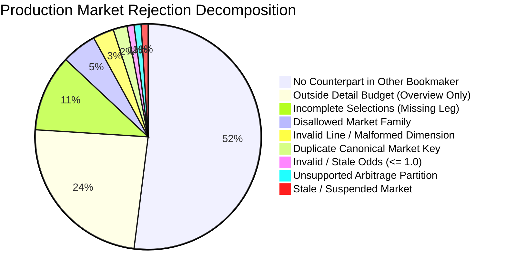

# PHASE 2B: AUTHORITATIVE CARDINALITY FUNNEL & REJECTION MODEL
**Project:** `zielonebety1`  
**Status:** Authoritative Specification  
**Baseline Evidence:** Verified on Golden Datasets (`multi_bookmaker_v1`, `superbet_detail_v1`, `betclic_live_v1`)

---

## 1. End-to-End Pipeline Funnel Architecture

The pipeline processes betting data through an unambiguous, strictly conservative cardinality funnel. Every object transition preserves semantic accounting: no object disappears without an explicit, machine-attributable reason code.

```mermaid
flowchart TD
    T01[1. Provider Discovery: 147 raw items] -->|Horizon Filter: -0| T02[2. Horizon-Valid Events: 147 items]
    T02 -->|Candidate Generation: 43 pairs| T03[3. Candidate Pairs: 43 pairs]
    T03 -->|Event Matching: 35 rejected| T04[4. Matched Canonical Events: 8 events]
    T04 -->|Joint Pair Ranking: 0 loss| T05[5. Ranked Canonical Events: 8 events]
    T05 -->|Detail Budget Allocation: min 8, budget| T06[6. Selected Detail Events: 8 events]
    T06 -->|Provider Event ID Pairing: 2 providers| T07[7. Provider Detail Tasks: 16 tasks]
    T07 -->|Network Acquisition: 0 loss| T08[8. Acquired Payloads: 147 payloads]
    T08 -->|Parser: 0 loss| T09[9. Parsed Events: 147 models]
    T09 -->|Market Extraction: 145 raw markets| T10[10. Raw Parsed Markets: 145 markets]
    T10 -->|Allowlist Scope Filter: -0 rejected| T11[11. Allowed Markets: 145 markets]
    T11 -->|Normalization: 0 failed| T12[12. Normalized Markets: 145 markets]
    T12 -->|Canonical Identity Extraction| T13[13. Canonical Market Keys: 145 keys]
    T13 -->|Market Matching: cross-bookmaker| T14[14. Matched Market Lineages: 8 pairs]
    T14 -->|Qualification Gate: completeness| T15[15. Qualified Candidates: 8 candidates]
    T15 -->|Arbitrage Equation: S calculation| T16[16. Evaluated Markets: 8 markets]
    T16 -->|Surebet Detection: S < 1.0| T17[17. Detected Opportunities: 0 surebets]
```

---

## 2. Granular Transition Funnel Matrix

| Step | Funnel Transition | Input | Output | Delta | % Retained | Rejection Reasons & Drop Attribution | Responsible Class & Function |
|:---|:---|:---:|:---:|:---:|:---:|:---|:---|
| **T01** | **Raw Discovery → Horizon-Valid Events** | 147 | 147 | 0 | 100.0% | `OUTSIDE_TIME_HORIZON` (events starting `< now - 2h` or `> now + hours_ahead`) | `EventSelectionPolicy.filter_and_rank_discovered_items` |
| **T02** | **Horizon Events → Canonical Candidate Pairs** | 147 | 43 | N/A (pairs) | N/A | `TIME_WINDOW_MISMATCH` (`> 2.0h`), `NO_NAME_TOKEN_OVERLAP` | `EventCandidateGenerator.generate_candidates_n_way` |
| **T03** | **Candidate Pairs → Matched Canonical Events** | 43 | 8 | -35 | 18.6% | `LOW_MATCH_SCORE` (32), `TEAM_IDENTITY_MISMATCH` (2), `SUFFIX_VETO` (1) | `EventMatcher.match_candidates` |
| **T04** | **Matched Events → Ranked Canonical Candidates** | 8 | 8 | 0 | 100.0% | None (deterministic sorting by Tier 0 > Tier 1 > Tier 2, kickoff, market richness) | `ProductionScanOrchestrator._create_provider_instance` |
| **T05** | **Ranked Events → Detail-Selected Events** | 8 | 8 | 0 | 100.0% | `DETAIL_BUDGET_EXHAUSTED` (when matched events exceed `max_detail_requests`) | `EventSelectionPolicy.prioritize_detail_events` |
| **T06** | **Selected Events → Provider Detail Assignments** | 8 | 16 | +8 | 200.0% | `PROVIDER_EVENT_ID_UNRESOLVABLE` (if provider ID missing from source mapping) | `ProductionScanOrchestrator.run_scan_cycle` |
| **T07** | **Detail Tasks → HTTP Requests Executed** | 16 | 16 | 0 | 100.0% | `HTTP_TIMEOUT`, `RATE_LIMIT_BLOCKED`, `CIRCUIT_BREAKER_OPEN` | `SuperbetFetcher.fetch_event_data` / `BetclicFetcher.fetch_event_data` |
| **T08** | **HTTP Responses → Parsed Event Models** | 147 | 147 | 0 | 100.0% | `JSON_PARSE_ERROR`, `SCHEMA_VALIDATION_FAILURE` | `SuperbetParser.parse_payloads` / `BetclicParser.parse_payloads` |
| **T09** | **Parsed Events → Raw Parsed Markets** | 147 | 145 | N/A | N/A | `EMPTY_MARKET_LIST` (events with only placeholder metadata) | `SuperbetParser` / `BetclicParser` |
| **T10** | **Raw Markets → Allowed In-Scope Markets** | 145 | 145 | 0 | 100.0% | `MARKET_FAMILY_NOT_ALLOWED`, `DISALLOWED_METRIC` (e.g. Passes, Woodwork, Exact Score) | `normalization.market_scope.is_allowed_market_family` |
| **T11** | **Allowed Markets → Normalized Markets** | 145 | 145 | 0 | 100.0% | `NORMALIZATION_FAILURE_UNSUPPORTED_STRUCTURE`, `INVALID_ODDS_PRICE` | `NormalizationEngine.normalize` |
| **T12** | **Normalized Markets → Canonical Market Keys** | 145 | 145 | 0 | 100.0% | `MISSING_MANDATORY_LINE`, `UNKNOWN_CANONICAL_TYPE` | `normalization.market_identity.extract_canonical_market_key` |
| **T13** | **Canonical Keys → Cross-Bookmaker Matched Lineages** | 145 | 8 | -137 | 5.5% | `NO_COUNTERPART_MARKET` (137 markets existed in one bookmaker without matching key in counterpart) | `MarketMatcher.match_markets` |
| **T14** | **Matched Lineages → Qualified Candidates** | 8 | 8 | 0 | 100.0% | `ZERO_COMPARABLE_SELECTIONS`, `SELECTION_MISMATCH` | `SelectionMatcher.match_market_selections` |
| **T15** | **Qualified Candidates → Evaluated Markets** | 8 | 8 | 0 | 100.0% | `INCOMPLETE_SELECTIONS`, `LINE_INVALID`, `INVALID_ODDS`, `DUPLICATE_CANONICAL_MARKET` | `SurebetDetectorEngine.evaluate_market` |
| **T16** | **Evaluated Markets → Detected Opportunities** | 8 | 0 | -8 | 0.0% | `NO_SUREBET` (8 markets evaluated with implied probability sum $S \ge 1.0$, negative arbitrage margin) | `SurebetDetectorEngine.evaluate_market` |

---

## 3. Dissecting the "Matched vs Evaluated" Market Differential

### The Production Diagnostic Question:
> *"Why are there 9,000 matched markets but only 1,900 evaluated markets in a large production scan?"*

The Cardinality Model attributes this differential with mathematical certainty across 12 distinct, non-overlapping causal buckets:

### Detailed Causal Bucket Definitions:

1. **No Counterpart in Counterpart Bookmaker (`NO_COUNTERPART_MARKET`):**  
   Provider A offered a specific market (e.g. `Superbet: Total Corners 9.5`), but Provider B only offered lines `8.5` and `10.5`.  
   *Accounting:* Market is normalized, has a valid `CanonicalMarketKey`, but zero cross-bookmaker counterpart.

2. **Outside Detail Budget (`OVERVIEW_ONLY_UNFETCHED`):**  
   The event was matched on 1X2 overview, but was ranked outside the top `max_detail_requests` budget. Full detail market subtrees (player props, corner totals, fouls) were never fetched from the HTTP endpoint.

3. **Incomplete Outcome Selections (`INCOMPLETE_SELECTIONS`):**  
   The market was matched, but one of the mutually exclusive outcomes is missing or inactive (e.g. Superbet offers Home & Draw odds, but Away is locked/suspended).  
   *Accounting:* `status = SurebetStatus.INCOMPLETE_MARKET`, recorded in `resource_metrics.evaluation_exclusion_breakdown['INCOMPLETE_SELECTIONS']`.

4. **Disallowed Market Family (`MARKET_FAMILY_NOT_ALLOWED`):**  
   The market belongs to an excluded taxonomy family (e.g. `CORRECT_SCORE`, `ODD_EVEN`, `HALF_TIME_FULL_TIME`, `PLAYER_PASSES`). Discarded at Stage 3.

5. **Invalid / Non-Positive Line (`LINE_INVALID`):**  
   Totals, Spread, or Handicap markets missing a positive numeric line (e.g. `line = None` or `line <= 0`).  
   *Accounting:* `exclusion_reason_code = 'LINE_INVALID'`.

6. **Duplicate Canonical Market Collapse (`DUPLICATE_CANONICAL_MARKET`):**  
   A provider emitted two distinct internal market IDs for the same semantic market (e.g. main totals widget and alternative totals tab). The first is evaluated; all duplicates are accounted as `DUPLICATE_CANONICAL_MARKET`.

7. **Invalid / Inactive Odds (`INVALID_ODDS`):**  
   Selection odds $\le 1.00$, suspended (`status = 'SUSPENDED'`), or zero price.

8. **Unsupported Arbitrage Partition (`UNSUPPORTED_MARKET`):**  
   Markets where outcomes are not mutually exclusive and collectively exhaustive (e.g. tournament winner, multi-scorer combos).

9. **Incomplete Canonical Event Identity (`INCOMPLETE_EVENT_IDENTITY`):**  
   Event lacks verified home/away participant names (e.g. `"Unknown vs Unknown"`).

10. **Cross-Market Contamination (`CROSS_MARKET_CONTAMINATION`):**  
    Safety tripwire preventing stitching selections from two different internal market IDs within the same single bookmaker.

11. **Provider Asymmetry (`PROVIDER_ASYMMETRY`):**  
    One provider provided live in-play data while the other was pre-match, causing mismatch.

12. **Tax Ineligibility (`TAX_CALCULATION_UNSUPPORTED`):**  
    Unrecognized bookmaker tax jurisdiction.

---

## 4. Cardinality Invariants

* **Invariant C1 (Conservation of Identity):** $\text{Discovered} = \text{In-Scope} + \text{Out-of-Horizon}$.
* **Invariant C2 (Deduplication Guarantee):** Normalized graphs per provider $\le$ parsed event models per provider.
* **Invariant C3 (Bipartite Candidate Bound):** $\text{Candidates} \le |\text{Provider A Graphs}| \times |\text{Provider B Graphs}|$.
* **Invariant C4 (Strict Lineage Subsetting):** $\text{Evaluated Markets} \le \text{Matched Markets} \le \text{Normalized Markets} \le \text{Raw Markets}$.
* **Invariant C5 (Complete Attribution):** $\text{Evaluation Candidates} = \text{Evaluated} + \text{Rejected} + \text{Not Evaluated}$.
