# PHASE 2A: CURRENT SYSTEM FORENSIC RECONSTRUCTION
**Project:** `zielonebety1`  
**Status:** Authoritative Forensic Specification  
**Baseline Commit:** `5c70a6c178e286897ab295deaa1abc2d0112fea0`  
**Verification Oracle:** Verified Phase 1 Differential & Deterministic Replay Infrastructure  

---

## 1. Executive Pipeline Architecture

When a user initiates a scan (or the automated scheduler fires), the system executes a deterministic, multi-stage causal chain from provider HTTP acquisition through domain normalization, cross-bookmaker entity matching, arbitrage qualification, surebet/valuebet detection, and API/UI serialization.

```mermaid
flowchart TD
    UI[Frontend / API Entrypoint: POST /api/v1/scan/run] --> Srv[PlatformAPIService.run_scan]
    Srv --> Orch[ProductionScanOrchestrator.run_scan_cycle]
    
    subgraph Stage_0 [Stage 0: Init & Profiling]
        Orch --> Prof[ScanExecutionProfiler + Tracemalloc]
    end

    subgraph Stage_1 [Stage 1: Coordinated Detail Prioritization]
        Prof --> Disc[Concurrent Discovery: Superbet & Betclic]
        Disc --> OverParse[Parse Overview Payloads]
        OverParse --> OverNorm[Normalize Overview Graphs]
        OverNorm --> OverMatch[Candidate Generation & Fast Event Matching]
        OverMatch --> PairRank[Joint Pair Ranking & Competition Tiering]
        PairRank --> SelPolicy[EventSelectionPolicy: Allocate Detail Budget]
    end

    subgraph Stage_2 [Stage 2: Provider Acquisition Engine]
        SelPolicy --> ExecEng[ExecutionEngine.execute per Provider]
        ExecEng --> FetchSB[SuperbetFetcher: Tier 2 Full Detail HTTP GET]
        ExecEng --> FetchBC[BetclicFetcher: Tier 2 Full Detail gRPC-Web POST]
        FetchSB --> ParseSB[SuperbetParser -> SuperbetEvent]
        FetchBC --> ParseBC[BetclicParser -> BetclicEvent]
        ParseSB --> ValSB[SuperbetValidator -> ValidationReport]
        ParseBC --> ValBC[BetclicValidator -> ValidationReport]
    end

    subgraph Stage_3 [Stage 3: Normalization & Scope Filtering]
        ValSB & ValBC --> ScopeCheck[Market Scope & Allowlist Check]
        ScopeCheck --> NormEng[NormalizationEngine.normalize]
        NormEng --> GraphFilter[EventSelectionPolicy.filter_normalized_graphs]
    end

    subgraph Stage_4 [Stage 4: Cross-Bookmaker Validation Pipeline]
        GraphFilter --> AvailGate{Providers with Data >= 2?}
        AvailGate -- Yes --> ValPipe[CrossBookmakerValidationPipeline.run_n_way]
        ValPipe --> CandGen[Candidate Generation: Blocking & Inverted Index]
        CandGen --> EvMatch[EventMatcher: Fuzzy, Aliases, Suffix Vetoes]
        EvMatch --> EvAgg[CanonicalEventAggregator -> CanonicalEvent]
        EvAgg --> MktMatch[MarketMatcher: CanonicalMarketKey]
        MktMatch --> SelMatch[SelectionMatcher: CanonicalSelectionKey]
    end

    subgraph Stage_5 [Stage 5: Arbitrage Detection & Accounting]
        SelMatch --> SureDet[SurebetDetectorEngine: Exact Decimal Tax Calculation]
        SureDet --> MktEval[MatchedMarketEvaluationRecord Accounting]
    end

    subgraph Stage_6 [Stage 6: Valuebet Subsystem]
        SureDet --> ValEng[ValuebetEngine + TheOddsApiReferenceProvider]
    end

    subgraph Stage_7 [Stage 7: Opportunity Lifecycle & Dispatch]
        ValEng --> LifeMgr[OpportunityLifecycleManager -> SQLite Database]
        LifeMgr --> Disp[OpportunityDispatcher -> Consumers]
    end

    subgraph Stage_8 [Stage 8: Result Assembly & Serialization]
        Disp --> Result[ScanCycleResult Assembly]
        Result --> ApiRes[APIResponse JSON Serialization]
        ApiRes --> Dashboard[Frontend Vue/React Dashboard & Explorer]
    end
```



---

## 2. Granular Stage-by-Stage Forensic Breakdown

### Stage 0: Configuration, Trigger & Profiling Setup
* **Stage Name:** `SCAN_INITIALIZATION`
* **Entry Point:** HTTP `POST /api/v1/scan/run` or `ProductionScanOrchestrator.run_scan_cycle()`
* **Exit Point:** Initialized `ScanExecutionProfiler`, `StageTiming`, `ResourceMetrics`, and execution context
* **Exact File:** `orchestration/scan_orchestrator.py` ([scan_orchestrator.py:413-449](file:///c:/Users/Adrian/Desktop/zielonebety1/orchestration/scan_orchestrator.py#L413-L449)), `api/routes.py` ([routes.py:122-158](file:///c:/Users/Adrian/Desktop/zielonebety1/api/routes.py#L122-L158)), `api/services.py`
* **Exact Class / Function:** `ProductionScanOrchestrator.run_scan_cycle(providers, evaluation_time)`
* **Caller:** `PlatformAPIService.run_scan()` or `DifferentialRunner.run_pipeline()` or `SchedulerService`
* **Callees:** `tracemalloc.start()`, `ScanExecutionProfiler.__init__()`, `set_current_scan_profiler()`
* **Input Type:** `ScanConfig` (containing `scan_mode`, `hours_ahead`, `effective_max_detail_requests`, `detail_workers`, `preferred_competitions`, `provider_timeout`), optional explicit provider mapping.
* **Output Type:** Initialized profiling state, `execution_id` string (e.g. `scan_20260817_120000_3b1e095e`).
* **Unit of Processing:** 1 Discrete Scan Cycle.
* **Cardinality Before:** N/A (cycle trigger).
* **Cardinality After:** 1 active execution context.
* **Rejections & Reason:** None (failure only on fatal misconfiguration).
* **Mutations:** Starts process memory tracing via `tracemalloc`. Sets global execution profiler thread context.
* **Ownership:** `ProductionScanOrchestrator` owns scan lifecycle; `ScanExecutionProfiler` owns timing spans.
* **Lifetime:** Scoped strictly to the duration of the scan cycle.
* **Concurrency / Workers:** Single master thread initializing context.
* **Downstream Consumer:** Stage 1 (Coordinated Discovery & Detail Prioritization).

---

### Stage 1: Coordinated Discovery & Detail Prioritization
* **Stage Name:** `PRE_DISCOVERY_AND_DETAIL_SELECTION`
* **Entry Point:** `scan_orchestrator.py:530`
* **Exit Point:** `bc_inst.configure_full_market_acquisition()` & `sb_inst.configure_full_market_acquisition()`
* **Exact File:** `orchestration/scan_orchestrator.py` ([scan_orchestrator.py:530-784](file:///c:/Users/Adrian/Desktop/zielonebety1/orchestration/scan_orchestrator.py#L530-L784)), `orchestration/event_selection.py` ([event_selection.py:506-665](file:///c:/Users/Adrian/Desktop/zielonebety1/orchestration/event_selection.py#L506-L665))
* **Exact Class / Function:** `ProductionScanOrchestrator.run_scan_cycle` → `EventSelectionPolicy.prioritize_detail_events()`
* **Caller:** `ProductionScanOrchestrator`
* **Callees:**
  - `sb_inst.discover()` (`providers/superbet/discovery/discovery.py`)
  - `bc_inst.discover()` (`providers/betclic/discovery/discovery.py`)
  - `sb_inst.parser.parse_payloads()` (`providers/superbet/parser/parser.py`)
  - `bc_inst.parser.parse_payloads()` (`providers/betclic/parser/parser.py`)
  - `NormalizationEngine.normalize()` (`normalization/engine.py`)
  - `EventCandidateGenerator.generate_candidates()` (`normalization/candidate_generator.py`)
  - `EventMatcher.match_candidates()` (`normalization/matcher.py`)
  - `DefaultEventSelectionPolicy.prioritize_detail_events()` (`orchestration/event_selection.py`)
* **Input Type:** Discovered item lists: `List[SuperbetDiscoveredItem]`, `List[BetclicDiscoveredItem]`.
* **Output Type:** `DetailPrioritizationResult` containing `selected_event_ids_superbet: List[str]`, `selected_event_ids_betclic: List[str]`, `overlap_selection_rate`, tier distributions.
* **Unit of Processing:** Discovered event overview headers across all participating bookmakers.
* **Cardinality Before:** Raw discovered items (e.g. Superbet: 127 items, Betclic: 20 items -> Total: 147 items).
* **Cardinality After:** Overlapping matched events (e.g. 8 matched pairs), selected detail IDs (up to `effective_max_detail_requests`, e.g. 15 in NORMAL mode, 50 in DEEP mode).
* **Objects Rejected / Outside Scope:** Non-overlapping events beyond detail budget, events outside horizon (`now - 2h` to `now + hours_ahead`).
* **Rejection Reasons:** `NOT_IN_OVERLAP_AND_BUDGET_EXHAUSTED`, `OUTSIDE_TIME_HORIZON`.
* **Mutations:**
  - Injects `_discovered_items_cache` into `SuperbetProvider` and `BetclicProvider` to prevent duplicate HTTP requests.
  - Updates provider configs with `selected_event_ids` and `EventSelectionMode.SELECTED`.
* **Ownership:** `ProductionScanOrchestrator` coordinates; `EventSelectionPolicy` decides priority; providers own cached discovery items.
* **Concurrency / Workers:** `ThreadPoolExecutor(max_workers=2)` executes discovery concurrently for Superbet and Betclic.
* **Rate Limiting & Retries:** Bounded by discovery rate limiters (Betclic HTML/SSR: 5 req/s; Superbet Fastly CDN: 30 req/s). Timeout: 45.0s.
* **Downstream Consumer:** Stage 2 (Provider Acquisition Engine).

---

### Stage 2: Provider Acquisition Engine
* **Stage Name:** `PROVIDER_ACQUISITION_AND_EXECUTION`
* **Entry Point:** `scan_orchestrator.py:823`
* **Exit Point:** `ProviderResult` objects in `provider_results: Dict[str, ProviderResult]`
* **Exact File:** `providers/base/execution_engine.py` ([execution_engine.py:57-214](file:///c:/Users/Adrian/Desktop/zielonebety1/providers/base/execution_engine.py#L57-L214)), `providers/superbet/fetch/fetcher.py`, `providers/betclic/fetch/fetcher.py`
* **Exact Class / Function:** `ExecutionEngine.execute(provider: BaseProvider)`
* **Caller:** `ProductionScanOrchestrator.run_scan_cycle`
* **Callees:**
  - `BaseProvider.initialize()`
  - `BaseProvider.discover()` (cache-guarded)
  - `BaseProvider.fetch()`
    * `SuperbetFetcher.fetch_event_data()`: Fetches full detail JSON from `https://production-superbet-offer-pl.freetls.fastly.net/v2/pl-PL/events/{id}` for selected IDs; reuses overview payload from `item.metadata['raw']` for unselected IDs.
    * `BetclicFetcher.fetch_event_data()`: Fetches full detail gRPC-web payload from `https://api.betclic.pl/v2/sportsbook/events/{id}` for selected IDs; reuses overview payload for unselected IDs.
  - `BaseProvider.parse()`
    * `SuperbetParser.parse_payloads()` -> `List[SuperbetEvent]`
    * `BetclicParser.parse_payloads()` -> `List[BetclicEvent]`
  - `BaseProvider.validate()`
    * `SuperbetValidator.validate_events()` -> `ValidationReport`
    * `BetclicValidator.validate_events()` -> `ValidationReport`
* **Input Type:** Configured provider instances with cached discovery items and selected detail event IDs.
* **Output Type:** `ProviderResult` containing:
  - `status: ProviderState` (`COMPLETED`, `DEGRADED`, or `FAILED`)
  - `discovered_objects: List[Any]`
  - `parsed_objects: List[Any]` (`SuperbetEvent` / `BetclicEvent`)
  - `validation_report: ValidationReport`
  - `metrics: ProviderMetrics`
  - `diagnostics: DiagnosticsReport`
* **Unit of Processing:** Individual provider instance executing its isolated fetch-parse-validate lifecycle.
* **Cardinality Before:** Configured providers (e.g. 2 providers).
* **Cardinality After:** Parsed provider domain objects (e.g. 147 parsed events, 145 raw markets in replay baseline).
* **Rejections / Validation Failures:** Invalid event structures, missing start dates, odds <= 1.0.
* **Rejection Reasons:** `MISSING_SCHEDULED_START`, `INVALID_EVENT_NAME`, `ZERO_VALID_MARKETS`, `MALFORMED_PAYLOAD`.
* **Raw Payload Lifetime:** Raw HTTP responses exist in `raw_data: List[Dict[str, Any]]` during fetch/parse. Parsed objects (`SuperbetEvent`, `BetclicEvent`) retain structured fields. Raw payload dictionaries are NOT attached to long-lived objects.
* **Concurrency / Workers:**
  - Inter-provider concurrency: `ThreadPoolExecutor(max_workers=min(len(providers), max_provider_workers))` (default 2 to 4 workers).
  - Intra-provider detail concurrency: Superbet uses `detail_workers` (default 8 to 15 workers); Betclic uses async batching/worker pool (default 4 to 8 workers).
* **Rate Limiting & Retries:**
  - Superbet: `RateLimiter` at 30 req/s, burst 20. `RetryEngine` max 3 retries with exponential backoff (initial delay 0.5s, backoff factor 2.0).
  - Betclic: `_detail_rate_limiter` at 25 req/s, burst 15, cooldown 50ms. `RetryEngine` max 3 retries.
* **Timeout Behavior:**
  - Provider worker timeout: `effective_provider_timeout` (NORMAL: 45.0s, DEEP: 120.0s).
  - If a provider times out, `ExecutionEngine` captures timeout safely, marks provider `FAILED`, and returns partial results without crashing orchestrator.
* **Downstream Consumer:** Stage 3 (Normalization & Scope Filtering).

---

### Stage 3: Normalization & Scope Filtering
* **Stage Name:** `NORMALIZATION_AND_SCOPE_FILTERING`
* **Entry Point:** `scan_orchestrator.py:1037`
* **Exit Point:** `provider_graphs: Dict[str, List[NormalizedGraph]]`
* **Exact File:** `normalization/engine.py` ([engine.py:65-138](file:///c:/Users/Adrian/Desktop/zielonebety1/normalization/engine.py#L65-L138)), `normalization/superbet_normalizer.py`, `normalization/betclic_normalizer.py`, `normalization/market_scope.py` ([market_scope.py:97-124](file:///c:/Users/Adrian/Desktop/zielonebety1/normalization/market_scope.py#L97-L124))
* **Exact Class / Function:** `NormalizationEngine.normalize(provider_name, parsed_objects)` → `BaseNormalizer.normalize_event()`
* **Caller:** `ProductionScanOrchestrator.run_scan_cycle`
* **Callees:**
  - `SuperbetNormalizer.normalize_event(superbet_event)`
  - `BetclicNormalizer.normalize_event(betclic_event)`
  - `is_allowed_market_family(market_type, metric, scope, raw_name)`
  - `EventSelectionPolicy.filter_normalized_graphs(graphs, limit, preferred_competitions, overlap_event_ids)`
* **Input Type:** `parsed_objects: List[Any]` from each `ProviderResult`.
* **Output Type:** `NormalizationResult` containing `graphs: List[NormalizedGraph]`, where each `NormalizedGraph` contains:
  - `event: Event` (canonical event entity with `internal_id`, `home_participant`, `away_participant`, `scheduled_start`, `provider_ids`)
  - `competition: Optional[Competition]`
  - `markets: List[Market]` (canonical market entities with `internal_id`, `event_id`, `market_type`, `line`, `metadata`)
  - `selections: List[Selection]` (canonical selections with `internal_id`, `market_id`, `selection_type`, `line`, `participant`)
  - `odds_list: List[Odds]` (decimal odds values bound to `selection_id`)
* **Unit of Processing:** Individual parsed event payload transformed into a fully connected relational graph.
* **Cardinality Before:** 147 parsed provider objects.
* **Cardinality After:** 147 `NormalizedGraph`s, 145 normalized markets.
* **Scope Rejections:** Disallowed market families (e.g. `CORRECT_SCORE`, `ODD_EVEN`, `HALF_TIME_FULL_TIME`, `PLAYER_PASSES`, combo special bets) are discarded early and counted in `resource_metrics.discarded_markets`.
* **Rejection Reasons:** `MARKET_FAMILY_NOT_ALLOWED`, `DISALLOWED_METRIC`, `NORMALIZATION_FAILURE_UNSUPPORTED_STRUCTURE`.
* **Mutations & Deduplication:** Deduplicates graphs by `(provider, provider_event_id)`; merges duplicate markets and selections into authoritative graph if multiple responses reference the same event ID.
* **Ownership:** `NormalizationEngine` owns transformation logic; normalizers own provider field mapping; resulting `NormalizedGraph` instances are immutable domain entities.
* **Downstream Consumer:** Stage 4 (Multi-Provider Matching Gate & Cross-Bookmaker Validation).

---

### Stage 4: Multi-Provider Matching Gate & Cross-Bookmaker Validation
* **Stage Name:** `CROSS_BOOKMAKER_VALIDATION_AND_MATCHING`
* **Entry Point:** `scan_orchestrator.py:1128`
* **Exit Point:** `CrossBookmakerValidationResult` containing canonical events, matched market lineages, and comparable selection pairs.
* **Exact File:** `normalization/validation_pipeline.py` ([validation_pipeline.py:321-804](file:///c:/Users/Adrian/Desktop/zielonebety1/normalization/validation_pipeline.py#L321-L804)), `normalization/candidate_generator.py`, `normalization/matcher.py`, `normalization/aggregator.py`, `normalization/market_matcher.py`, `normalization/selection_matcher.py`
* **Exact Class / Function:** `CrossBookmakerValidationPipeline.run_n_way(all_items)`
* **Caller:** `ProductionScanOrchestrator.run_scan_cycle`
* **Callees:**
  - `EventCandidateGenerator.generate_candidates_n_way()`: Blocking keys on kickoff window (+/- 2 hours) and team name tokens.
  - `EventMatcher.match_candidates()`: Computes fuzzy similarity, token overlap, team aliases, competition compatibility, and suffix vetoes (`U19`, `Women`, `Reserves`).
  - `CanonicalEventAggregator.aggregate()`: Merges matched event pairs into unified `CanonicalEvent` instances with stable IDs (`cev:sport:home:away:kickoff`).
  - `MarketMatcher.match_markets()`: Extracts `CanonicalMarketKey` for each market and matches across bookmakers by exact semantic key equivalence.
  - `SelectionMatcher.match_market_selections()`: Extracts `CanonicalSelectionKey` and matches outcome selections (e.g. `HOME` <-> `HOME`, `OVER` <-> `OVER`).
* **Input Type:** `all_matchable_graphs: List[NormalizedGraph]` from all providers with available data.
* **Output Type:** `CrossBookmakerValidationResult` containing:
  - `event_candidates: List[EventCandidate]` (candidate pairs compared)
  - `event_decisions: List[MatchDecision]` (`MATCHED`, `AMBIGUOUS`, `REJECTED`)
  - `canonical_events: List[CanonicalEvent]` (aggregated multi-bookmaker events)
  - `event_validation_records: List[CanonicalEventValidationRecord]`
  - `comparable_selections: List[ComparableSelectionPair]` (matched selection pairs with full lineage)
  - `metrics: PipelineMetrics`
* **Unit of Processing:** Cross-bookmaker graph pairs.
* **Cardinality Before:** 147 normalized event graphs, 145 normalized markets.
* **Cardinality After:**
  - 43 candidate pairs generated.
  - 8 matched canonical events (35 candidate pairs rejected).
  - 8 matched market lineages (8 canonical market candidates).
  - 24 comparable selection pairs (3 selections per 1X2 market × 8 markets).
* **Rejections & Attribution:**
  - Candidate Rejections: `LOW_MATCH_SCORE`, `TEAM_IDENTITY_MISMATCH`, `SUFFIX_VETO` (e.g. Senior team vs U19).
  - Market Rejections: `UNSUPPORTED_CANONICAL_TYPE`, `LINE_MISMATCH`, `NO_COUNTERPART_MARKET`.
  - Selection Rejections: `SELECTION_TYPE_MISMATCH`, `INCOMPATIBLE_PARTICIPANT`.
* **Zero Odds Comparison Invariant:** Selection matching matches outcome semantics ONLY. It NEVER compares or ranks odds values (reserved for Stage 5).
* **Ownership:** `CrossBookmakerValidationPipeline` coordinates; each sub-matcher owns its mathematical stage decision.
* **Downstream Consumer:** Stage 5 (Arbitrage Detection & Accounting).

---

### Stage 5: Surebet Detection & Accounting
* **Stage Name:** `SUREBET_DETECTION_AND_EVALUATION`
* **Entry Point:** `scan_orchestrator.py:1314`
* **Exit Point:** `SurebetDetectionResult` and `resource_metrics.market_evaluation_records`
* **Exact File:** `normalization/surebet.py` ([surebet.py:339-784](file:///c:/Users/Adrian/Desktop/zielonebety1/normalization/surebet.py#L339-L784)), `core/tax_engine.py`
* **Exact Class / Function:** `SurebetDetectorEngine.detect(validation_result)` → `evaluate_market()`
* **Caller:** `ProductionScanOrchestrator.run_scan_cycle`
* **Callees:**
  - `TaxEngine.calculate_net_odds()`: Applies Polish 12% turnover tax to calculate effective decimal odds `effective_odds = odds * (1 - 0.12)`.
  - `SurebetDetectorEngine.evaluate_market()`: Evaluates market completeness, maximizes best odds per outcome, computes arbitrage sum `S = sum(1 / effective_odds_i)` and margin `(1/S) - 1`.
* **Input Type:** `CrossBookmakerValidationResult` containing canonical events and matched market lineages.
* **Output Type:** `SurebetDetectionResult` containing:
  - `opportunities: List[SurebetOpportunity]` (confirmed surebets where `S < 1.0`)
  - `evaluations: List[MarketSurebetEvaluation]` (detailed records for all evaluated markets)
  - `market_evaluation_records: List[MatchedMarketEvaluationRecord]` (comprehensive funnel accounting for all canonical candidates)
* **Unit of Processing:** Canonical market candidate `(canonical_event_id, canonical_market_key)`.
* **Cardinality Before:** 8 matched canonical market candidates.
* **Cardinality After:** 8 evaluated markets, 0 detected surebet opportunities (realistic market margins > 1.0).
* **Rejections & Reason Codes:**
  - `INCOMPLETE_SELECTIONS`: Missing required outcomes (e.g. Home and Draw present, but Away missing).
  - `LINE_INVALID`: Line missing or non-positive for totals/handicaps.
  - `INCOMPLETE_EVENT_IDENTITY`: Canonical event missing verified team names.
  - `UNSUPPORTED_MARKET`: Market family not supported for complete arbitrage partitioning.
  - `ZERO_COMPARABLE_SELECTIONS`: Matched market had 0 comparable selection pairs.
  - `DUPLICATE_CANONICAL_MARKET`: Duplicate lineage collapsed into primary canonical key.
* **Mathematical Invariants:** Strict Decimal arithmetic; zero early float conversion; tax applied before inverse probability summation.
* **Downstream Consumer:** Stage 6 (Valuebet Subsystem) and Stage 7 (Opportunity Lifecycle & Dispatch).

---

### Stage 6: Valuebet Subsystem
* **Stage Name:** `VALUEBET_DETECTION_AND_EVALUATION`
* **Entry Point:** `scan_orchestrator.py:1571`
* **Exit Point:** `ValueBetDetectionResult` and `ValuebetLifecycleBatch`
* **Exact File:** `valuebets/engine.py`, `valuebets/lifecycle.py`, `reference_odds/provider.py`
* **Exact Class / Function:** `ValuebetEngine.detect_valuebets()`, `ValuebetLifecycleManager.evaluate_candidates()`
* **Caller:** `ProductionScanOrchestrator.run_scan_cycle`
* **Callees:**
  - `TheOddsApiReferenceProvider.fetch_reference_events()`: Fetches sharp reference market odds (e.g. Pinnacle / Betfair exchange via The Odds API).
  - `ValuebetEngine.calculate_fair_probability()`: Devigs sharp reference market odds to obtain true probability.
  - `ValuebetQualityPolicy.evaluate()`: Checks minimum value percent threshold, bookmaker coverage, and odds reasonableness.
* **Input Type:** Normalized provider graphs and sharp reference events.
* **Output Type:** `ValueBetDetectionResult` with qualified valuebet candidates.
* **Unit of Processing:** Individual bookmaker market selections compared against devigged sharp reference probabilities.
* **Downstream Consumer:** Stage 7 (Opportunity Lifecycle & Dispatch).

---

### Stage 7: Opportunity Lifecycle, Alert Policy & Dispatch
* **Stage Name:** `LIFECYCLE_AND_ALERT_DISPATCH`
* **Entry Point:** `scan_orchestrator.py:1550`
* **Exit Point:** `LifecycleDispatchSummary`, database updates, and dispatched notifications
* **Exact File:** `normalization/lifecycle.py`, `normalization/alert_policy.py`, `normalization/dispatcher.py`, `database/repositories/opportunity_repository.py`
* **Exact Class / Function:** `OpportunityLifecycleManager.process_and_dispatch()`, `OpportunityDispatcher.dispatch()`
* **Caller:** `ProductionScanOrchestrator.run_scan_cycle`
* **Callees:**
  - `OpportunityLifecycleManager.evaluate_batch()`: Identifies `NEW`, `UPDATED`, `SUPPRESSED`, and `EXPIRED` opportunities.
  - `DefaultOpportunityAlertPolicy.should_alert()`: Enforces minimum margin, quality score, alert cooldown, and duplicate suppression.
  - `OpportunityRepository.record_opportunity()` / `record_delivery_result()`: Persists opportunities and delivery audit log in SQLite.
  - `OpportunityDispatcher.dispatch()`: Dispatches payload to registered consumers (Telegram, Webhook, WebSocket).
* **Input Type:** `SurebetDetectionResult` / `ValueBetDetectionResult`.
* **Output Type:** `LifecycleDispatchSummary` (counts of new, updated, suppressed, expired, and delivered alerts).
* **Unit of Processing:** Detected opportunities.
* **Downstream Consumer:** Stage 8 (Result Packaging & Telemetry Assembly).

---

### Stage 8: Result Assembly, Telemetry & Resource Guard
* **Stage Name:** `RESULT_PACKAGING_AND_TELEMETRY`
* **Entry Point:** `scan_orchestrator.py:1654`
* **Exit Point:** Sealed `ScanCycleResult` object
* **Exact File:** `orchestration/scan_orchestrator.py` ([scan_orchestrator.py:1898-1985](file:///c:/Users/Adrian/Desktop/zielonebety1/orchestration/scan_orchestrator.py#L1898-L1985)), `orchestration/profiler.py`
* **Exact Class / Function:** `ScanExecutionProfiler.finish_scan()` → `ScanCycleResult.__init__()`
* **Caller:** `ProductionScanOrchestrator.run_scan_cycle`
* **Callees:**
  - `tracemalloc.get_traced_memory()`: Measures peak heap memory consumption.
  - `profiler.finish_scan()`: Generates structured timing and counter trace.
  - Resource budget validator: Asserts scan duration, memory, and HTTP requests remain within `ResourceBudget`.
* **Input Type:** All stage outputs, metrics, and diagnostics.
* **Output Type:** Immutable, fully populated `ScanCycleResult` containing 50+ structured diagnostic telemetry fields.
* **Downstream Consumer:** Stage 9 (API Serialization & Frontend Presentation).

---

### Stage 9: API Serialization & Frontend Presentation
* **Stage Name:** `API_SERIALIZATION_AND_UI_CONSUMPTION`
* **Entry Point:** `api/routes.py:122`
* **Exit Point:** Client HTTP JSON response & reactive UI state update
* **Exact File:** `api/routes.py`, `api/models.py`, `api/services.py`, `web/src/views/DashboardView.vue`, `web/src/views/ExplorerView.vue`
* **Exact Class / Function:** `APIRouter.handle_post_run_scan()` → `APIResponse.to_dict()`
* **Caller:** Frontend client via Axios / Fetch API
* **Input Type:** `ScanCycleResult` from orchestrator.
* **Output Type:** Standardized JSON Envelope:
  ```json
  {
    "status_code": 200,
    "data": {
      "execution_id": "scan_20260817_120000_3b1e095e",
      "cycle_status": "SUCCESS",
      "duration_seconds": 1.45,
      "discovered_events_count": 147,
      "matched_events_count": 8,
      "markets_matched_count": 8,
      "evaluated_markets_total": 8,
      "detected_opportunities_count": 0,
      "resource_metrics": { ... },
      "diagnostics": { ... }
    },
    "errors": [],
    "warnings": [],
    "execution_time_ms": 1450.2
  }
  ```
* **Frontend Presentation:** Dashboard displays real-time execution KPI cards, stage funnel charts, active opportunities table, nearest arbitrage proximity indicator, and profiler stage breakdowns.

---

## 3. Strict Boundary Invariants

1. **DISCOVERY vs SELECTION:** Discovery identifies the entire available fixture catalog from the provider without fetching full market subtrees. Selection policy applies business rules (competition tiers, kickoff horizon, cross-provider overlap) to allocate the finite detail request budget.
2. **SELECTION vs ACQUISITION:** Selection decides *which* provider IDs will receive detail requests. Acquisition executes HTTP/gRPC requests within rate limits and worker bounds.
3. **ACQUISITION vs PARSING:** Acquisition manages network I/O, retries, and bytes. Parsing converts raw JSON payloads into provider-specific typed models.
4. **PARSING vs NORMALIZATION:** Parsing retains provider-native data models. Normalization maps provider models to canonical domain entities (`Event`, `Market`, `Selection`, `Odds`).
5. **NORMALIZATION vs MARKET SCOPE:** Normalization converts syntax and structure. Market Scope enforces the platform allowlist, discarding unsupported market families.
6. **MARKET MATCHING vs QUALIFICATION:** Market Matching establishes semantic equivalence between provider markets. Qualification verifies market completeness (all mutually exclusive outcomes present with active odds).
7. **QUALIFICATION vs EVALUATION:** Qualification validates eligibility. Evaluation computes implied probability sums, Polish tax deductions, and arbitrage margins.
8. **EVALUATION vs DETECTION:** Evaluation assesses individual market equations. Detection identifies opportunities meeting positive margin and confidence thresholds.
9. **RESULT MODEL vs API SERIALIZATION:** Result models (`ScanCycleResult`) represent runtime domain state. API serialization formats clean, sanitized JSON representations without raw data leakage.
10. **API vs FRONTEND PRESENTATION:** API delivers machine-readable data contracts. Frontend visualizes data and manages user interactions without business logic mutation.
