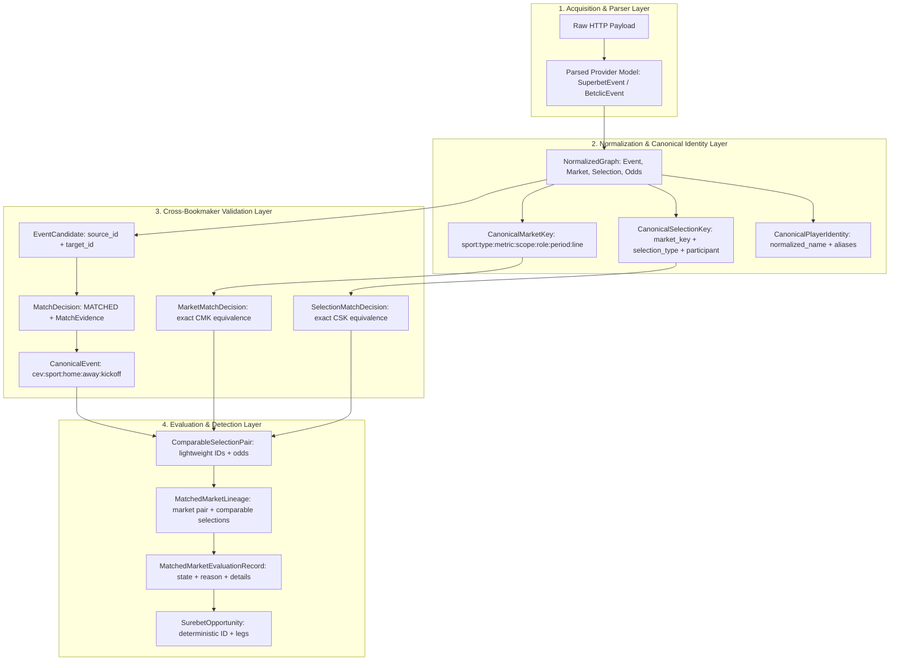

# PHASE 2C: OBJECT LINEAGE & PROVENANCE MODEL
**Project:** `zielonebety1`  
**Status:** Authoritative Specification  
**Baseline Evidence:** Verified on Golden Datasets (`multi_bookmaker_v1`, `superbet_detail_v1`, `betclic_live_v1`)

---

## 1. Lineage Architecture Principles

The Zielone Bety lineage model allows tracing any detected opportunity, evaluation record, or matched selection back through every intermediate transformation down to the original provider HTTP payload—**without retaining giant raw JSON dictionaries in long-lived domain objects**.



---

## 2. Event Lineage

Every event transitions through 7 distinct identity representations:

1. **Provider Discovery Event:**  
   *Representation:* `SuperbetDiscoveredItem` / `BetclicDiscoveredItem`  
   *Identifiers:* `provider_event_id` (e.g. Superbet: `13222121`, Betclic: `1179820576735232`), `name`, `start_time`.
2. **Canonical Event Candidate:**  
   *Representation:* `EventCandidate(source_event_id, target_event_id)`  
   *Identifiers:* Internal entity IDs: `ev-sb-13222121`, `ev-bc-1179820576735232`.
3. **Matched Event Decision:**  
   *Representation:* `MatchDecision` with `MatchEvidence`  
   *Identifiers:* `decision = MatchDecisionType.MATCHED`, `total_score = 0.942`, `home_team_similarity = 0.95`.
4. **Canonical Event Identity:**  
   *Representation:* `CanonicalEvent`  
   *Identifier:* Deterministic URI key: `cev:football:hacken:halmstads:2026-08-17T17:00:00Z`.
5. **Selected Detail Request:**  
   *Representation:* Provider detail task in `EventSelectionPolicy.prioritize_detail_events()`  
   *Identifiers:* Selected provider event ID (e.g. `13222121`).
6. **Normalized Event Entity:**  
   *Representation:* `Event` inside `NormalizedGraph`  
   *Identifiers:* `internal_id`, `provider_ids = {'superbet': '13222121', 'betclic': '1179820576735232'}`.
7. **Final Result Entity:**  
   *Representation:* Entry in `ScanCycleResult.validation_result.canonical_events` and API envelope.

---

## 3. Market Lineage

Every betting market transitions through 8 distinct stages:

```
[Raw HTTP JSON] 
      ↓ (SuperbetParser / BetclicParser)
[Parsed Market Model: market_id="m-sb-991", name="Liczba goli", line=2.5]
      ↓ (SuperbetNormalizer / BetclicNormalizer)
[Canonical Market Entity: internal_id="mkt_a1b2", market_type="TOTALS", line=Decimal('2.5')]
      ↓ (extract_canonical_market_key)
[CanonicalMarketKey: "football:TOTALS:GOALS:MATCH:all:FULL_TIME:2.5"]
      ↓ (MarketMatcher.match_markets)
[MarketMatchDecision: MATCHED, source="mkt_a1b2", target="mkt_c3d4"]
      ↓ (CrossBookmakerValidationPipeline)
[MatchedMarketLineage: links source & target markets with comparable selections]
      ↓ (SurebetDetectorEngine.evaluate_market)
[MatchedMarketEvaluationRecord: state="EVALUATED", implied_probability_sum=1.042]
      ↓ (SurebetDetectorEngine / Result Packaging)
[Final Telemetry & API Record]
```

### Traceability Guarantee:
Given any `MatchedMarketEvaluationRecord`, one can resolve:
* `canonical_event_id` -> Parent fixture
* `canonical_market_key` -> Semantic definition (`football:TOTALS:GOALS:MATCH:all:FULL_TIME:2.5`)
* `source_provider` -> Bookmaker A name (e.g. `"superbet"`)
* `target_provider` -> Bookmaker B name (e.g. `"betclic"`)
* `source_market_id` -> Provider A native market ID
* `target_market_id` -> Provider B native market ID

---

## 4. Selection Lineage

Each individual betting outcome preserves full cross-stage lineage:

```python
ComparableSelectionPair(
    canonical_event_id="cev:football:hacken:halmstads:2026-08-17T17:00:00Z",
    canonical_market_key=CanonicalMarketKey(
        market_type="1X2",
        line=None,
        period="FULL_TIME",
        scope="MATCH",
        metric="GOALS",
        participant_role=None,
        sport="football",
        player_name=None,
    ),
    canonical_selection_key=CanonicalSelectionKey(
        market_key=...,
        selection_type="HOME",
        participant=None,
    ),
    source_provider="superbet",
    target_provider="betclic",
    source_event_id="13222121",
    target_event_id="1179820576735232",
    source_internal_event_id="ev_sb_001",
    target_internal_event_id="ev_bc_001",
    source_market_id="mkt_sb_101",
    target_market_id="mkt_bc_201",
    source_selection_id="sel_sb_1001",
    target_selection_id="sel_bc_2001",
    source_selection=Selection(internal_id="sel_sb_1001", selection_type="HOME", ...),
    target_selection=Selection(internal_id="sel_bc_2001", selection_type="HOME", ...),
    source_odds=Odds(decimal_odds=Decimal("1.85"), provider="superbet"),
    target_odds=Odds(decimal_odds=Decimal("1.80"), provider="betclic"),
    event_evidence=MatchEvidence(...),
    market_evidence={"source_market_name": "Wynik meczu", "target_market_name": "1X2"},
    selection_evidence={"source_selection_name": "1", "target_selection_name": "Hacken"},
)
```

---

## 5. Player Props Lineage & Identity Resolution

Player props require multi-dimensional identity resolution across disparate bookmaker representations:

### Superbet Player Lineage (Real Replay Evidence):
1. **Raw Provider Payload:**  
   `response_detail_000.json`: Market `"Strzelec gola - mecz"`, selection `"Lewandowski, Robert"`, odds `1.75`.
2. **Parser Extraction:**  
   `SuperbetParser` extracts `SuperbetMarket` (`market_type="PLAYER_GOALS"`) and `SuperbetSelection` (`participant="Lewandowski, Robert"`).
3. **Normalization & Diacritic Normalization:**  
   `normalize_player_name("Lewandowski, Robert")` -> `"robert lewandowski"`. Accents stripped (NFKD), inverted comma name normalized, whitespace collapsed.
4. **Canonical Market Key Construction:**  
   `extract_canonical_market_key()` produces:  
   `CanonicalMarketKey(market_type="PLAYER_GOALS", metric="GOALS", scope="PLAYER", player_name="robert lewandowski", line=Decimal("0.5"))`.  
   Key String: `football:PLAYER_GOALS:GOALS:PLAYER:all:robert_lewandowski:FULL_TIME:0.5`.
5. **Selection Key Construction:**  
   `CanonicalSelectionKey(market_key=..., selection_type="YES", participant="robert lewandowski")`.

### Betclic Player Lineage:
1. **Raw Provider Payload:**  
   Betclic gRPC-web detail: Market `"Strzelec gola"`, selection `"R. Lewandowski"`, odds `1.72`.
2. **Parser & Alias Resolution:**  
   `BetclicParser` extracts selection with `participant="R. Lewandowski"`.
3. **Canonical Player Identity Matcher:**  
   Player alias resolver matches `"R. Lewandowski"` against event squad context (Barcelona) -> Canonical Player Identity: `"robert lewandowski"`.
4. **Cross-Bookmaker Equivalence:**  
   `CanonicalMarketKey` string: `football:PLAYER_GOALS:GOALS:PLAYER:all:robert_lewandowski:FULL_TIME:0.5`.
5. **Market Matcher Match:**  
   Superbet `robert_lewandowski` $\Longleftrightarrow$ Betclic `robert_lewandowski` $\implies$ `MATCHED`.

---

## 6. Lightweight Memory Invariant Enforcement

To prevent memory leaks and bloated caches, the lineage system enforces the following Phase 0 invariants:

1. **No Raw Dictionaries in Domain Entities:**  
   `CanonicalEvent`, `Market`, `Selection`, `Odds`, `ComparableSelectionPair`, and `SurebetOpportunity` do NOT contain raw API response dictionaries.
2. **Provenance via String References:**  
   Lineage is maintained via string identifiers (`source_provider`, `source_event_id`, `source_market_id`, `source_selection_id`).
3. **Ephemerality of Raw Response Objects:**  
   Raw response dictionaries exist solely inside `SuperbetFetcher.fetch_event_data` and `SuperbetParser.parse_payloads` stack frames. Once parsing completes, raw dictionaries are released for garbage collection.
4. **Lightweight Evidence Dictionaries:**  
   `selection_evidence` and `market_evidence` store strictly primitive strings (e.g. `{"source_name": "1", "target_name": "Hacken"}`), consuming $< 200$ bytes per pair.
