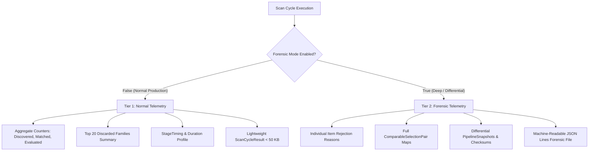

# PHASE 2I: OBSERVABILITY & STAGE TELEMETRY CONTRACT
**Project:** `zielonebety1`  
**Status:** Authoritative Specification  
**Baseline Evidence:** Verified on `orchestration/profiler.py`, `orchestration/models.py`, `differential/models.py`

---

## 1. Observability Design Principles

1. **Deterministic Telemetry:** Stage counts, execution IDs, and status codes are strictly typed, machine-readable, and deterministic across identical test replays.
2. **Zero In-Memory Explosion (Two-Tier Model):**  
   * **NORMAL TELEMETRY:** Production default. Aggregate counters, stage timings, error counts, and top 20 rejected family summaries. Emits $< 50$ KB JSON payloads.
   * **FORENSIC TELEMETRY:** Activated on-demand (e.g. `--forensics`, `scan_mode="DEEP"`, differential tests). Captures complete granular record maps, item-level rejection reasons, and selection lineages.
3. **No Unattributed Losses:** Every rejected object must increment a specific categorical reason counter.
4. **Separation of Concerns:** Telemetry collection never alters domain evaluation or betting mathematics.

---

## 2. Stage Telemetry Contract Schema

Every pipeline stage produces a standard structured telemetry record adhering to this schema:

```json
{
  "$schema": "https://json-schema.org/draft/2020-12/schema",
  "title": "StageTelemetryRecord",
  "type": "object",
  "required": [
    "execution_id",
    "stage_name",
    "status",
    "duration_ms",
    "input_count",
    "output_count",
    "rejected_count",
    "rejection_reasons"
  ],
  "properties": {
    "execution_id": { "type": "string", "example": "scan_20260817_120000_3b1e095e" },
    "stage_name": { 
      "type": "string", 
      "enum": [
        "pre_discovery",
        "detail_selection",
        "acquisition",
        "parsing",
        "validation",
        "normalization",
        "scope_filtering",
        "candidate_generation",
        "event_matching",
        "canonical_aggregation",
        "market_matching",
        "selection_matching",
        "surebet_detection",
        "valuebet_detection",
        "lifecycle_management",
        "notification_dispatch",
        "reconciliation"
      ]
    },
    "provider": { "type": ["string", "null"], "example": "superbet" },
    "status": { "type": "string", "enum": ["SUCCESS", "PARTIAL", "FAILED", "DEGRADED", "SKIPPED"] },
    "duration_ms": { "type": "number", "example": 142.5 },
    "input_count": { "type": "integer", "example": 147 },
    "output_count": { "type": "integer", "example": 8 },
    "rejected_count": { "type": "integer", "example": 139 },
    "rejection_reasons": {
      "type": "object",
      "additionalProperties": { "type": "integer" },
      "example": {
        "NO_COUNTERPART_MARKET": 137,
        "MARKET_FAMILY_NOT_ALLOWED": 2
      }
    },
    "counters": {
      "type": "object",
      "additionalProperties": { "type": "integer" }
    },
    "parent_stage": { "type": ["string", "null"] },
    "forensic_records": {
      "type": "object",
      "description": "Populated ONLY in FORENSIC mode"
    }
  }
}
```

---

## 3. Two-Tier Telemetry Architecture



### Normal vs Forensic Telemetry Comparison:

| Feature / Metric | Normal Telemetry (Production Default) | Forensic Telemetry (On-Demand / Replay) |
|:---|:---|:---|
| **Activation Flag** | `scan_mode="NORMAL"` | `scan_mode="DEEP"` or `DifferentialRunner` |
| **Output Size** | 20 KB – 50 KB per scan | 500 KB – 5 MB per scan |
| **Memory Overhead** | $< 5$ MB RAM | 20 MB – 50 MB RAM |
| **Event Rejections** | Rejection counts breakdown | Item-by-item rejected pairs with fuzzy scores & vetoes |
| **Market Rejections** | Aggregated rejection counters | Full record map `(canonical_event_id, canonical_market_key)` |
| **Selection Lineage** | Total comparable selections count | Full list of `ComparableSelectionPair`s with native odds |
| **HTTP Forensics** | Total & detail HTTP request counts | Per-request URI, latency, worker ID, and retry trace |
| **Differential Snapshot** | N/A | Full `PipelineSnapshot` with SHA256 deterministic checksum |

---

## 4. Standard Stage Metrics & Identifiers

| Stage Name | Input Counter | Output Counter | Primary Rejection Reasons Captured |
|:---|:---|:---|:---|
| `discovery` | Discovered HTTP items | Valid discovered items | `OUTSIDE_TIME_HORIZON`, `MALFORMED_HEADER` |
| `selection` | Eligible discovered events | Selected detail events | `DETAIL_BUDGET_EXHAUSTED`, `LOW_COMPETITION_TIER` |
| `acquisition` | Selected detail event IDs | Acquired raw payloads | `HTTP_TIMEOUT`, `RATE_LIMIT_BLOCKED`, `FETCH_ERROR` |
| `parsing` | Raw response payloads | Parsed provider models | `JSON_PARSE_ERROR`, `SCHEMA_VALIDATION_FAILURE` |
| `normalization` | Parsed provider models | Normalized graphs | `NORMALIZATION_FAILURE`, `INVALID_ODDS_PRICE` |
| `scope_filtering`| Raw parsed markets | In-scope allowed markets | `MARKET_FAMILY_NOT_ALLOWED`, `DISALLOWED_METRIC` |
| `event_matching` | Candidate event pairs | Matched canonical events | `LOW_MATCH_SCORE`, `TEAM_IDENTITY_MISMATCH`, `SUFFIX_VETO` |
| `market_matching`| Normalized markets | Matched market lineages | `NO_COUNTERPART_MARKET`, `LINE_MISMATCH`, `UNSUPPORTED_TYPE` |
| `selection_match`| Outcome selections | Comparable selection pairs| `SELECTION_TYPE_MISMATCH`, `INCOMPATIBLE_PARTICIPANT` |
| `surebet_detect` | Matched market candidates| Detected surebets | `NO_SUREBET`, `INCOMPLETE_SELECTIONS`, `LINE_INVALID` |
| `lifecycle` | Detected opportunities | Dispatched alerts | `ALERT_COOLDOWN`, `MIN_MARGIN_SUPPRESSED`, `EXPIRED` |

---

## 5. Implementation & Diagnostic Export

The observability contract is implemented in `orchestration/profiler.py` and exported through:
* `ScanCycleResult.resource_metrics`
* `ScanCycleResult.stage_timings`
* `ScanCycleResult.diagnostics['scan_trace']`
* API endpoint `GET /api/v1/scan/trace/latest`
* API endpoint `GET /api/v1/scan/trace/{trace_id}`
