# PHASE 2J: TARGET PIPELINE ARCHITECTURE SPECIFICATION
**Project:** `zielonebety1`  
**Status:** Target Architectural Blueprint  
**Design Principle:** Evolutionary, highly decoupled, deterministic architecture built on actual repository types.

---

## 1. Target Pipeline Stage Architecture

```mermaid
flowchart TD
    subgraph S0 [0. Controller & Configuration]
        API[APIRouter / Controller] --> Config[ScanConfig]
    end

    subgraph S1 [1. Coordinated Discovery & Detail Planning]
        Config --> DiscPlan[CoordinatedDetailSelectionPlanner]
        DiscPlan --> DiscSB[SuperbetProvider.discover]
        DiscPlan --> DiscBC[BetclicProvider.discover]
        DiscSB & DiscBC --> PlanEngine[Joint Event Ranking & Budget Allocation]
        PlanEngine --> DetailPlan[DetailAcquisitionPlan: selected_event_ids]
    end

    subgraph S2 [2. Parallel Provider Acquisition Engine]
        DetailPlan --> ExecEng[ExecutionEngine]
        ExecEng --> FetchSB[SuperbetFetcher]
        ExecEng --> FetchBC[BetclicFetcher]
        FetchSB --> ParseSB[SuperbetParser]
        FetchBC --> ParseBC[BetclicParser]
        ParseSB --> ValSB[SuperbetValidator]
        ParseBC --> ValBC[BetclicValidator]
        ValSB & ValBC --> ProvRes[ProviderResult Containers]
    end

    subgraph S3 [3. Scope Filtering & Domain Normalization]
        ProvRes --> ScopeGate[MarketScopeAllowlistFilter]
        ScopeGate --> NormEng[NormalizationEngine]
        NormEng --> NormGraphs[List NormalizedGraph]
    end

    subgraph S4 [4. Cross-Bookmaker Validation & Matching]
        NormGraphs --> CandGen[EventCandidateGenerator]
        CandGen --> EvMatcher[EventMatcher]
        EvMatcher --> Aggregator[CanonicalEventAggregator -> CanonicalEvent]
        Aggregator --> MktMatcher[MarketMatcher -> CanonicalMarketKey]
        MktMatcher --> SelMatcher[SelectionMatcher -> CanonicalSelectionKey]
        SelMatcher --> Lineage[CrossBookmakerValidationResult]
    end

    subgraph S5 [5. Arbitrage Evaluation & Opportunity Detection]
        Lineage --> SureDet[SurebetDetectorEngine: Decimal + TaxEngine]
        SureDet --> ValEng[ValuebetEngine + TheOddsApiReferenceProvider]
    end

    subgraph S6 [6. Lifecycle, Persistence & Dispatch]
        SureDet & ValEng --> LifeMgr[OpportunityLifecycleManager]
        LifeMgr --> Repo[(SQLite OpportunityRepository)]
        LifeMgr --> Dispatcher[OpportunityDispatcher -> Notifications]
    end

    subgraph S7 [7. Telemetry, Packaging & Delivery]
        Dispatcher --> Telemetry[StageTelemetryCollector & Profiler]
        Telemetry --> Result[ScanCycleResult]
        Result --> Serializer[API Envelope Serializer]
        Serializer --> UI[Frontend Real-Time Dashboard]
    end
```



---

## 2. Explicit System Boundaries & Contracts

### 1. The Controller & Configuration Boundary
* **Input Contract:** `ScanConfig(scan_mode, max_detail_requests, hours_ahead, preferred_competitions, resource_budget)`.
* **Immutability:** `ScanConfig` is an immutable frozen dataclass.
* **Guarantees:** No global mutable configuration overrides during execution.

### 2. The Coordinated Detail Planning Boundary (`CoordinatedDetailSelectionPlanner`)
* **Problem Solved:** Decouples the ~250 lines of inline pre-discovery logic from `scan_orchestrator.py` into a standalone, testable planning component.
* **Input:** Raw discovery items from participating providers.
* **Output:** `DetailAcquisitionPlan` containing immutable `Dict[str, List[str]]` mapping provider names to prioritized provider event IDs.
* **Invariant:** Pairing between Superbet and Betclic event IDs is computed deterministically in a single pass before deep acquisition starts.

### 3. The Acquisition & Network Boundary (`ExecutionEngine`)
* **Input:** Provider instances with explicit `DetailAcquisitionPlan`.
* **Output:** `ProviderResult` containing parsed models and execution metrics.
* **Raw Payload Lifetime Boundary:** Raw response payloads exist solely inside the `Fetcher.fetch()` → `Parser.parse()` call stack. Domain models do NOT retain references to raw HTTP response dictionaries.
* **Error Isolation:** Any provider failure or timeout is trapped inside `ExecutionEngine.execute()`, returning `status=ProviderState.FAILED` without aborting other providers.

### 4. The Normalization & Domain Boundary (`NormalizationEngine`)
* **Input:** `parsed_objects` (provider-specific models).
* **Output:** `NormalizedGraph` containing canonical domain entities (`Event`, `Competition`, `Market`, `Selection`, `Odds`).
* **Market Scope Filter:** Enforces platform allowlist (`is_allowed_market_family`) at the boundary. Disallowed markets are rejected early before graph instantiation.
* **Deduplication:** Deduplication on `(provider, provider_event_id)` is strictly deterministic.

### 5. The Cross-Bookmaker Validation Boundary (`CrossBookmakerValidationPipeline`)
* **Input:** `List[NormalizedGraph]` from all available providers.
* **Output:** `CrossBookmakerValidationResult` containing:
  - `canonical_events: List[CanonicalEvent]`
  - `matched_markets: List[MatchedMarketLineage]`
  - `comparable_selections: List[ComparableSelectionPair]`
* **Zero Odds Comparison Invariant:** Selection matching establishes semantic equivalence of outcomes only. It NEVER compares, ranks, or calculates odds margins.

### 6. The Arbitrage Evaluation Boundary (`SurebetDetectorEngine`)
* **Input:** `CrossBookmakerValidationResult`.
* **Output:** `SurebetDetectionResult` with `SurebetOpportunity` instances and complete `MatchedMarketEvaluationRecord` accounting.
* **Tax Invariant:** All bookmaker prices pass through `TaxEngine.calculate_net_odds()` before inverse probability summation $S = \sum \frac{1}{\text{effective\_odds}_i}$.
* **Boundary Condition:** $S < 1.0 \implies \text{SUREBET}$; $S \ge 1.0 \implies \text{NO\_SUREBET}$.

### 7. The Lifecycle & Storage Boundary (`OpportunityLifecycleManager`)
* **Input:** `SurebetDetectionResult` and `ValueBetDetectionResult`.
* **Output:** `LifecycleDispatchSummary` and updated SQLite repository state.
* **State Machine:** Deterministically classifies opportunities as `NEW`, `ACTIVE`, `UPDATED`, `SUPPRESSED`, or `EXPIRED`.

### 8. The Telemetry & Result Packaging Boundary (`ScanExecutionProfiler`)
* **Input:** Stage metrics, profiler spans, tracemalloc heap metrics.
* **Output:** `ScanCycleResult` containing 50+ structured diagnostic telemetry fields.
* **Two-Tier Mode:** Emits lightweight summary in `NORMAL` mode; emits complete granular object lineages in `FORENSIC` / `DEEP` mode.

### 9. The API Serialization & Presentation Boundary
* **Input:** `ScanCycleResult`.
* **Output:** Clean JSON API envelopes delivered over HTTP/WebSocket.
* **Invariant:** Zero business logic or betting math recalculated in the presentation layer.

---

## 3. Concurrency, Timeout & Rate Limiting Model

```
                    ┌─────────────────────────┐
                    │ Production Orchestrator │
                    └───────────┬─────────────┘
                                │
             ┌──────────────────┴──────────────────┐
             │ ThreadPoolExecutor(max_workers=2-4) │
             └──────────┬──────────────────┬───────┘
                        │                  │
            ┌───────────▼────────┐ ┌───────▼────────────┐
            │ Superbet Execution │ │ Betclic Execution  │
            │ Engine (Sync HTTP) │ │ Engine (gRPC/HTTP) │
            └───────────┬────────┘ └───────┬────────────┘
                        │                  │
              ┌─────────▼────────┐ ┌───────▼────────────┐
              │ RateLimiter:     │ │ RateLimiter:       │
              │ 30 req/s, b=20   │ │ 25 req/s, b=15     │
              │ Detail Workers:  │ │ Detail Workers:    │
              │ 8-15 threads     │ │ 4-8 async pool     │
              │ Timeout: 45/120s │ │ Timeout: 45/120s   │
              └──────────────────┘ └────────────────────┘
```
